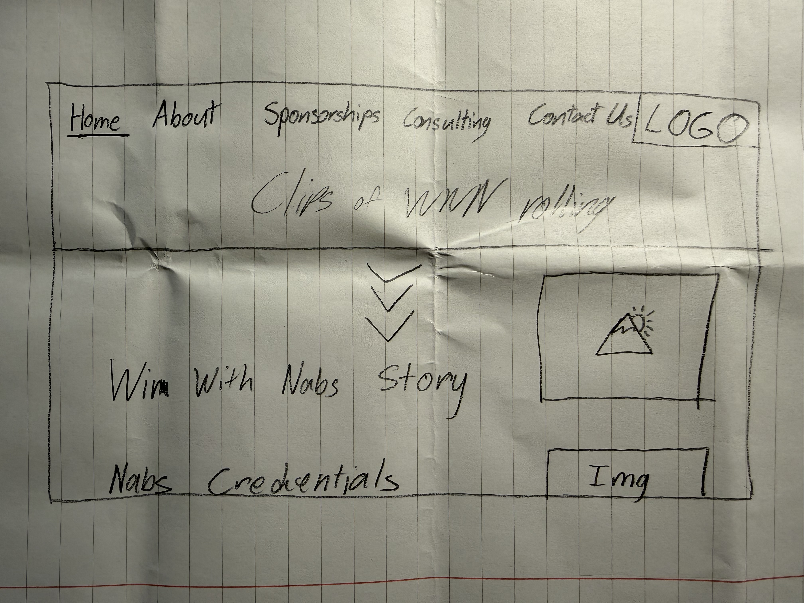

## Client Interview

**Client:** Nabeel "Nabs" Ishoof, host of Win With Nabs, a podcast/YouTube (my younger brother)
channel recorded at Grove Podcast Studios in Miami. Originally a combat sports
interview show, now pivoting toward business and tech. Past guests include
Dana White, Asher Genoot, and Audie Attar.

**Purpose:** A professional business site that shows what Nabs offers
(sponsorships, consulting, and guest spots) and turns visitors into inquiries.
It is not a fan page for the channel.

**Audience:**
- Brands considering a sponsorship: need proof of reach and credibility
  (subscriber count, 2M+ lifetime views, notable guests, past sponsor)
- People who want advice on building a social media career: need to know
  consulting exists and how to book a call
- Prospective guests: need a clear way to pitch themselves for the show

**Key action:** Submit a sponsorship inquiry. Consulting calls and guest
requests are secondary actions.

**Pages needed:**
- Home: looping clips of the show, the Win With Nabs story, and Nabs'
  credentials (subs, 2M+ views, featured guests, Karate Combat)
- About: Nabs' background and the show's business/tech direction
- Sponsorships (primary): what a partnership looks like, featured guests,
  past sponsor (Karate Combat), inquiry form
- Consulting: social media career advice, "Book a Call" (no prices listed)
- Contact Us: general inquiries and guest requests, with forms sent to
  nabeelishoof@gmail.com

**Content status:**
- Have: subscriber count, 2M+ lifetime views, featured guests (Dana White,
  Asher Genoot, Audie Attar), past sponsor (Karate Combat), contact email
- Still need from Nabs: exact current subscriber count, logo files, video
  clips for the hero section, headshot and studio photos, guest photos he's
  allowed to use, updated bio for the business/tech pivot, booking link for
  consulting calls (e.g. Calendly), OK to use the Karate Combat logo
- Deliberately excluded: detailed audience stats (his call)

**Style preferences:** Between sleek corporate and gritty fight poster:
professional, but with edge. Colors matched to his existing logo. He
specifically doesn't want a generic, template-looking "AI-made" site.

**Inspiration sites:**
- Grove Podcast Studios (grovepodcast.com), liked. It leads with what the
  business actually sells, and every service has a direct "Book Now" action.
  He wants his site oriented the same way: around his offers, not "contact
  me if interested."
- Creator Science sponsor page (creatorscience.com/sponsor), didn't love it.
  Too plain; he wants his site to look cooler.
- The Casuals MMA (casualsmma.com), didn't love it. Same feedback: not
  visually strong enough.

## Layout Plan

**Starting prompt given to AI:**
Build a home page for Win With Nabs, a podcast hosted by Nabeel Ishoof. The
style is professional with some edge, somewhere between sleek corporate and
fight poster. Use a dark background, bold headlines, and one accent color
matched to the logo. Avoid a generic template look.

Layout, top to bottom:
1. Nav bar: links on the left (Home, About, Sponsorships, Consulting,
   Contact Us), logo on the right.
2. Hero: full-width background video of Win With Nabs clips playing on loop,
   with a scroll-down arrow at the bottom.
3. "The Win With Nabs Story": text on the left, a large image on the right.
4. "Nabs' Credentials": text on the left (subscriber count, 2M+ lifetime
   views, featured guests, Karate Combat partnership), a smaller image on
   the right.

Make it mobile-friendly: on small screens, the text and image in each
section stack vertically.